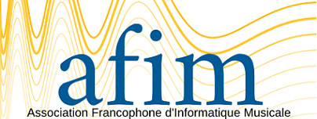

# Réalisation du logo de l'AFIM
*documnent de travail*

## Ancien Logo

### Problèmes
* le jaune c'est délicat pour le design. Il ne peut fonctioner qu'avec un fond coloré ... Donc pas réutilisable pour des titres web ou rapports
* l'italique est peut être de trop : on a déjà opposition de police et de couleur
* un logo avec une forme développée c'est rare . ça contraint à une taille plutot grande (458 * 141) alors que l'habitude c'est plutot (200 * 150)

### A garder
* l'opposition des polices
* l'idée de deux couleurs complémentaires

## Nouveau logo
### A voir
- [ ] choix du duo de couleurs
- [ ] présence du sous titre ? 

### Propositions
#### symetrie 

#### slow down

#### slow down (avec les 2e couleurs)
