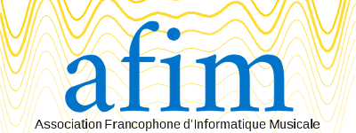

# Réalisation du logo de l'AFIM
*documnent de travail*

## Ancien Logo

### Problèmes
* le jaune c'est délicat pour le design. Il ne peut fonctioner en couleur de police qu'avec un fond coloré (comme le bleu du logo). Donc pas réutilisable sur le web ou dans des titres de rapports...
* l'italique est peut être de trop : on a déjà opposition de police + de couleur
* un logo avec une forme développée c'est rare . ça contraint à une taille plutot grande pour un logo (458 * 141) alors que l'habitude c'est plutot (200 * 150)

### A garder
* le contraste dans les polices (avec et sans empatements)
* l'idée de deux couleurs complémentaires

## Nouveau logo
### A voir
* choix des 2 couleurs
* présence du sous titre ? 

### Propositions
#### symetrie

#### slow down
