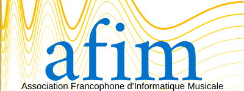
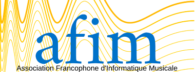
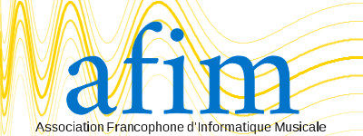

# Réalisation du logo de l'AFIM
*documnent de travail*

## Ancien Logo

### Problèmes
* le jaune c'est délicat pour le design. 
* un logo avec taille grande (458 * 141), taille plus habituelle est (200 * 150)

### A garder
* l'opposition des polices
* l'idée de deux couleurs complémentaires

## Nouveau logo

### propositions
#### alpha

#### linear

### Propositions septembre
#### symetrie 

#### slow down

#### slow down (avec les 2e couleurs)

#### slow down bis

